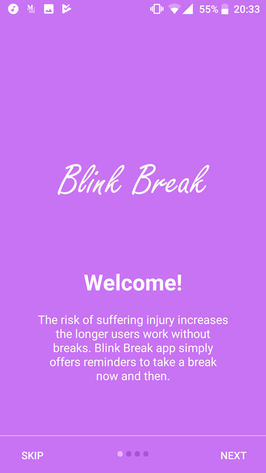
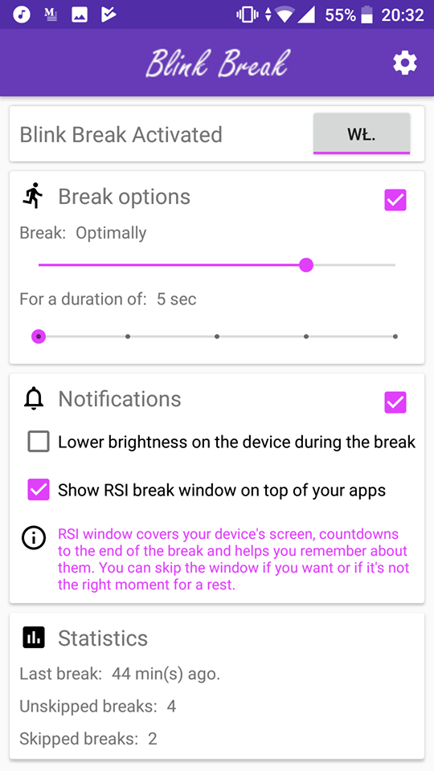
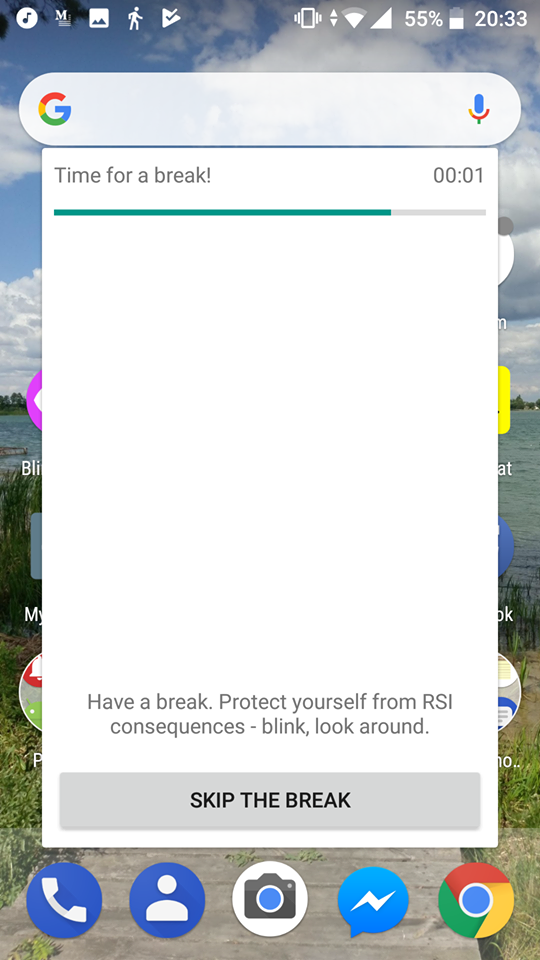
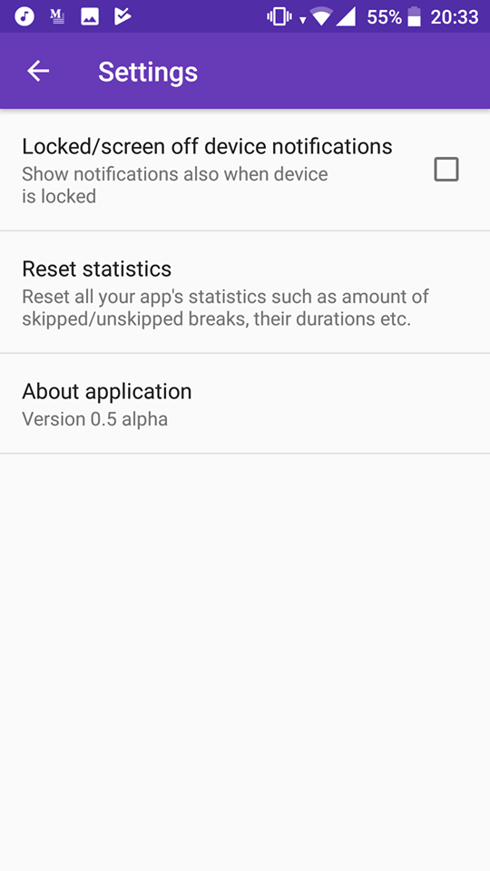

# Blink Break app - Android + Kotlin

## Screenshots (ver 0.8 alpha)

  
  
  
  

## App overview

Repetitive Strain Injury is an illness which can occur as a result of continuous work with a mouse, keyboard or smarthphone. The risk of suffering injury increases the longer users work without breaks. Blink Break app simply offers reminders to take a break now and then.

## Features

Plan your breaks with app's section "Break options". Set an interval between them and your preffered duration of the break. Enable notifications to be notified about the breaks. Enable RSI window or lowering brightness to be forced by our alert window to have a rest and relax. Blink, look away and do not stick to your phone!

## Author Michał Smutkiewicz, 2018
